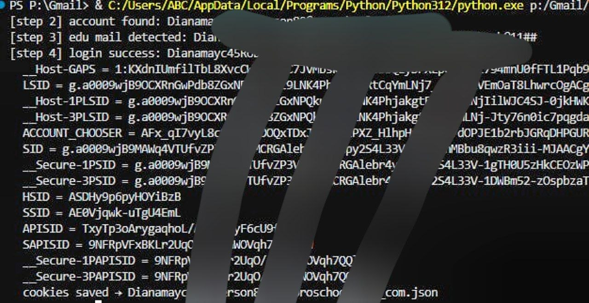

# Gmail Login Api

Automates Google account sign-in and get session cookies.

## Features

- Full Google sign-in flow via internal API
- **Edu mail support** — automatically handles Google Workspace Terms of Service speedbump
- Saves session cookies
- Detects invalid email, wrong password, and edu mail automatically

## Preview




## Flow

```
accounts.google.com → identifier → password → (edu: accept ToS) → session saved
```

## Output

```
[step 2] account found: user@example.com
[step 3] edu mail detected: user@example.com
[step 4] login success: user@example.com
  cookies saved → user_at_example_com.json
```

## Full Source

This repository contains a demo version.  
For the full source contact me on Telegram:

**[@inception00007](https://t.me/inception00007)**

## Disclaimer

For educational purposes only. Use responsibly and only on accounts you own.
