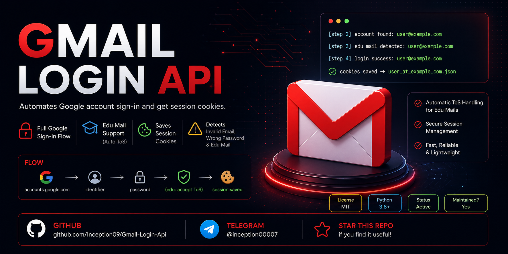
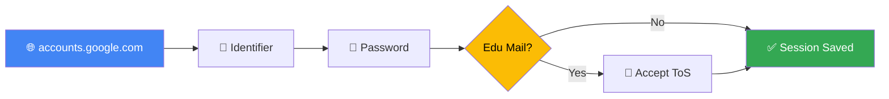

# 📧 Gmail Login Api

<div align="center">



<!-- Typing Animation -->
<a href="https://git.io/typing-svg">
  
</a>

<br/><br/>

<!-- Badges Row 1 -->


<!-- Badges Row 2 -->


<!-- New API Badges -->


</div>

---

## ✨ Features

<div align="center">

| Feature | Description |
|:-------:|:-----------|
| 🔐 | **Full Google Sign-in Flow** via internal API |
| 🎓 | **Edu Mail Support** — handles Google Workspace Terms of Service speedbump |
| 🍪 | **Saves Session Cookies** automatically after login |
| 🚨 | **Smart Error Detection** — invalid email, wrong password, edu mail |

</div>

---

## 🌐 Public API

> **Base URL:** `http://gmail-api.catmmo.com`

> 🚧 **This is a preview API** — shared freely for testing purposes.  
> ❌ **Do not abuse it.** Excessive requests, automation at scale, or malicious use will get you blocked.  
> If you need the full version or higher limits, contact me on [Telegram](https://t.me/inception00007).

### `POST /login`

Authenticates a Workspace/Edu email and returns session cookies.

#### 📥 Request

```http
POST /login HTTP/1.1
Host: gmail-api.catmmo.com
Content-Type: application/json
```

```json
{
  "email": "your_email@edu_or_workspace.com",
  "password": "your_password"
}
```

> ⚠️ **Note:** `@gmail.com` accounts are **not supported**. Only **Edu / Workspace** emails work.Contact me if you want gmail.com login.

---

#### 📤 Responses

**✅ Success — `200 OK`**

```json
{
  "status": "success",
  "cookies": {
    "SID": "...",
    "HSID": "...",
    "__Secure-1PSID": "...",
    "__Secure-3PSID": "...",
    "...": "other cookies"
  }
}
```

> Status can also be `"edu_success"` for Google Workspace/Edu accounts.

**❌ Error — `400 Bad Request`** *(gmail.com used)*

```json
{
  "error": "gmail.com not supported in this api contact me if you need. Use edu mail/workspace mail"
}
```

**❌ Error — `401 Unauthorized`** *(wrong credentials or blocked)*

```json
{
  "status": "wrong_password"
}
```

| Status Value | Meaning |
|:---:|:---|
| `wrong_password` | Incorrect password |
| `invalid_email` | Email does not exist |
| `botguard` | Google bot protection triggered |
| `error` | Unknown / unexpected error |

---

## 🐍 Client Script

Use the included `gmail-login-api.py` to call the API directly from Python.

```python
import requests

API_URL = "https://gmail-api.catmmo.com/login"

def login_and_get_cookies(email, password):
    payload = {"email": email, "password": password}
    try:
        response = requests.post(API_URL, json=payload)
        if response.status_code == 200:
            data = response.json()
            if data.get("status") in ("success", "edu_success"):
                return data.get("cookies")
        else:
            print(f"API Error ({response.status_code}): {response.json()}")
    except requests.exceptions.RequestException as e:
        print(f"Network Error: {e}")
    return None

if __name__ == "__main__":
    email = input("Enter your email: ")
    password = input("Enter your password: ")
    cookies = login_and_get_cookies(email, password)
    if cookies:
        print("Login successful! Cookies:", cookies)
    else:
        print("Login failed.")
```

**Install dependency & run:**

```bash
pip install requests
python gmail-login-api.py
```

---

## 📸 Preview of Source

<div align="center">
  
  
  
  
</div>

---

## 🔄 Flow of Source

```
accounts.google.com → identifier → password → (edu: accept ToS) → session saved
```

<div align="center">



</div>

---

## 📤 Output

```bash
[step 2] account found: user@example.com
[step 3] edu mail detected: user@example.com
[step 4] login success: user@example.com
  cookies saved → user_at_example_com.json
```

---

## 📖 Full Source

> This repository contains a **demo version**.  
> For the full source, contact me on Telegram:

<div align="center">

[](https://t.me/inception00007)

</div>

---

## ⚖️ Disclaimer

> ⚠️ **For educational purposes only.**  
> Use responsibly and **only on accounts you own**. Do not abuse the public API.

---

<div align="center">

<!-- Footer Wave -->


*Made with ❤️ by [@inception00007](https://t.me/inception00007)*

</div>
