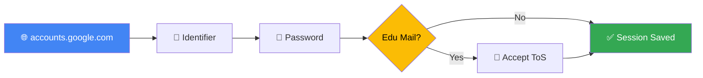

<div align="center">

<!-- Animated Header -->


<!-- Typing Animation -->
<a href="https://git.io/typing-svg">
  
</a>

<br/><br/>

<!-- Badges Row 1 -->


<!-- Badges Row 2 -->


</div>

---

## ✨ Features

<div align="center">

| Feature | Description |
|:-------:|:-----------|
| 🔐 | **Full Google Sign-in Flow** via internal API |
| 🎓 | **Edu Mail Support** — handles Google Workspace Terms of Service speedbump |
| 🍪 | **Saves Session Cookies** automatically after login |
| 🚨 | **Smart Error Detection** — invalid email, wrong password, edu mail |

</div>

---

## 📸 Preview

<div align="center">
  
  
  
  
</div>

---

## 🔄 Flow

```
accounts.google.com → identifier → password → (edu: accept ToS) → session saved
```

<div align="center">



</div>

---

## 📤 Output

```bash
[step 2] account found: user@example.com
[step 3] edu mail detected: user@example.com
[step 4] login success: user@example.com
  cookies saved → user_at_example_com.json
```

---

## 📖 Full Source

> This repository contains a **demo version**.  
> For the full source, contact me on Telegram:

<div align="center">

[](https://t.me/inception00007)

</div>

---

## ⚖️ Disclaimer

> ⚠️ **For educational purposes only.**  
> Use responsibly and **only on accounts you own**.

---

<div align="center">

<!-- Footer Wave -->


*Made with ❤️ by [@inception00007](https://t.me/inception00007)*

</div>
